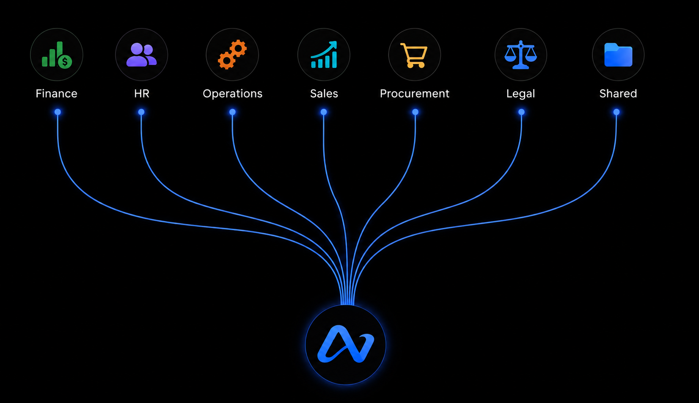

# back-office-agents

[](https://opensource.org/licenses/MIT)
[](https://github.com/allNeurons-AI/back-office-agents/stargazers)
[](https://github.com/allNeurons-AI/back-office-agents/network)
[](https://github.com/allNeurons-AI/back-office-agents/releases)
[](https://github.com/allNeurons-AI/back-office-agents/commits/main)


A public collection of AI agent skills built by allNeurons for back-office business workflows organized as domain plugins for Claude.



## What's here

Skills for Finance, Legal, HR, Operations, Sales, and Compliance — published as a Claude Code plugin marketplace. Install a domain plugin to get all its skills in one step.

---

## Install via Claude Code

Add this marketplace in Claude Code settings (Plugins → Add Marketplace):

```
https://github.com/allNeurons-AI/back-office-agents.git
```

Then install any domain plugin to get its skills. Skills are namespaced by domain:

| Plugin | Skills installed | Commands |
|---|---|---|
| **Finance** | GL Flux Explainer, CoC Lease Extraction | `/finance:allneurons-flux`, `/finance:coc-lease-extraction` |
| **Legal** | Contract Tabular Review | `/legal:allneurons-tabular-review` |
| **HR** | *(coming soon)* | — |
| **Operations** | Daily Brief | `/operations:daily-brief` |
| **Sales** | Call Prep | `/sales:call-prep` |
| **Compliance** | *(coming soon)* | — |

---

## Skills

### Finance

**`/finance:allneurons-flux`** — GL Account Flux Explainer  
Explains what drove the change in a GL account between two periods. Names the vendors, quotes the memos, flags currency and entity issues. Connects to NetSuite, Share Drive/SharePoint, or a file you provide. Delivers a timestamped Excel workbook (Summary, Flux, GL Details tabs).

**`/finance:coc-lease-extraction`** — Change of Control Lease Extraction  
Reads a commercial lease package (original lease + all amendments, riders, and exhibits) and extracts every Change of Control obligation into a structured Excel summary with 20 standardized columns. Tested at 86% extraction accuracy on hard clauses like consent-to-transfer and take-private provisions.

### Legal

**`/legal:allneurons-tabular-review`** — Contract Tabular Review  
Reads commercial contracts in full and extracts 20 key terms (parties, term, governing law, assignment, liability, indemnification, and more) into a citation-backed Excel workbook. Every answer is tied to its source section. Includes an optional Change of Control deep-dive.

### Operations

**`/operations:daily-brief`** — Daily Brief  
Pulls today's calendar, email, and chat into one page: lists every meeting plainly, detects real scheduling conflicts (double-books, impossible back-to-backs, double duty), decides which side should yield with a stated reason, and writes out a suggested fix. Surfaces what's due today or overdue, what people are actually asking of the user, and what's handled versus genuinely open. Never sends anything.

### Sales

**`/sales:call-prep`** — Call Prep  
On demand, before an external call: identifies the account and who owns it, pulls relationship history from CRM/email/chat/docs, checks recent public signal on the company, and writes a 1-2 page Word document brief — who's on the call, where things stand, what's happening with them right now, a stated objective with discovery questions, and a sourced citation list. Never sends anything.

---

## Repository structure

```
.claude-plugin/
└── marketplace.json          ← marketplace manifest (6 domain plugins)

finance/
├── .claude-plugin/plugin.json
└── skills/
    ├── allneurons-flux/SKILL.md
    └── coc-lease-extraction/SKILL.md

legal/
├── .claude-plugin/plugin.json
└── skills/
    └── allneurons-tabular-review/SKILL.md

hr/                           ← .claude-plugin/plugin.json (skills coming soon)

operations/
├── .claude-plugin/plugin.json
└── skills/
    └── daily-brief/SKILL.md

sales/
├── .claude-plugin/plugin.json
└── skills/
    └── call-prep/SKILL.md

compliance/                   ← .claude-plugin/plugin.json (skills coming soon)
```

Each domain folder is a self-contained plugin. Adding a new skill means dropping a `skills/<skill-name>/SKILL.md` file into the right domain folder — no marketplace changes needed.

---

## Adding a new skill

1. Create `skills/<skill-name>/` inside the relevant domain folder.
2. Add `SKILL.md` with a `description` frontmatter and the skill instructions.
3. That's it — Claude  auto-discovers it the next time the plugin syncs.

```
finance/
└── skills/
    └── my-new-skill/
        └── SKILL.md          ← description: frontmatter + skill instructions
```

The skill becomes available as `/finance:my-new-skill` after install.

---

## About allNeurons

[allNeurons](https://allneurons.ai) designs and deploys AI agent skills for enterprise back-office workflows. Every skill we build for a client gets published here so the broader community can benefit.

[Contact us](https://allneurons.ai/#contact/US) to build custom skills for your team.

Open-sourced for the community.
