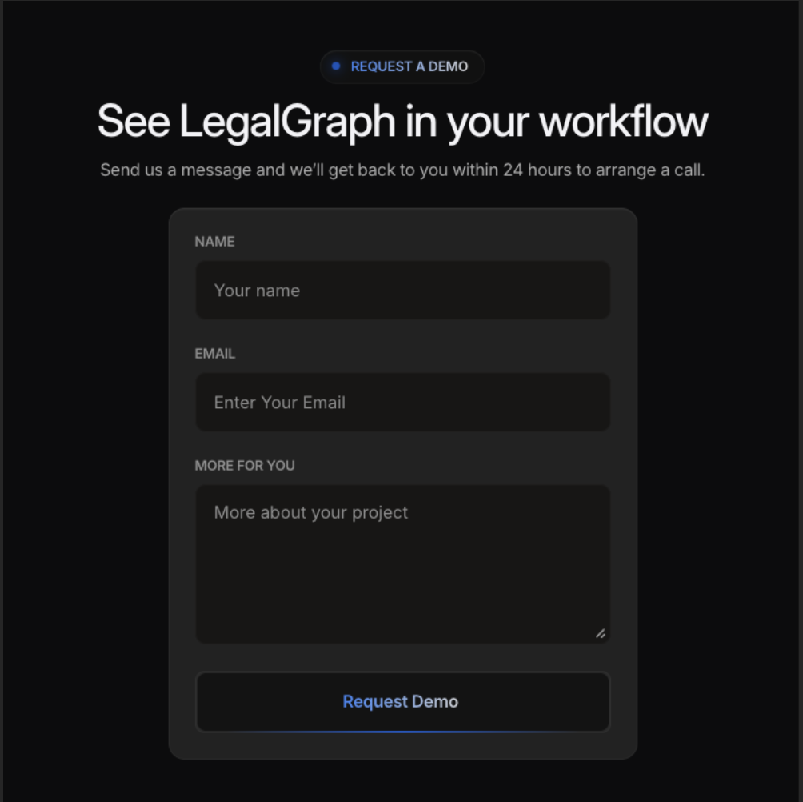
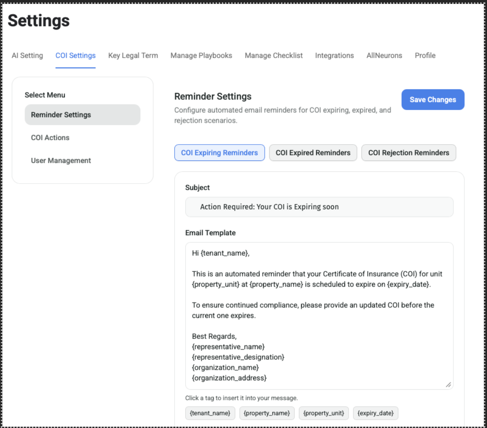
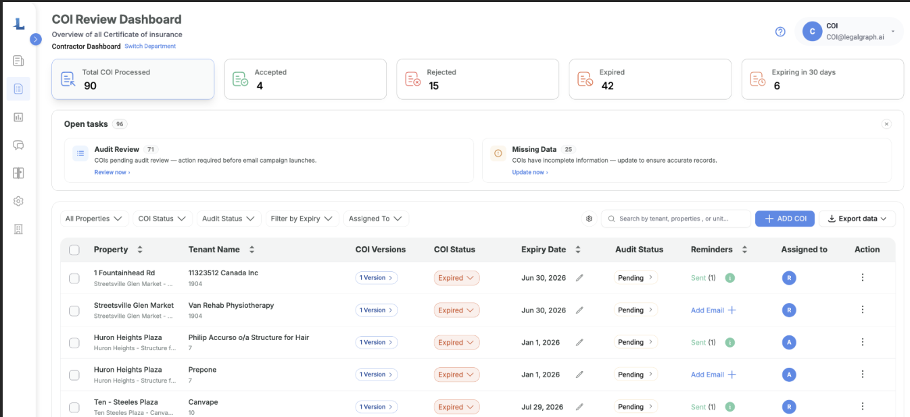
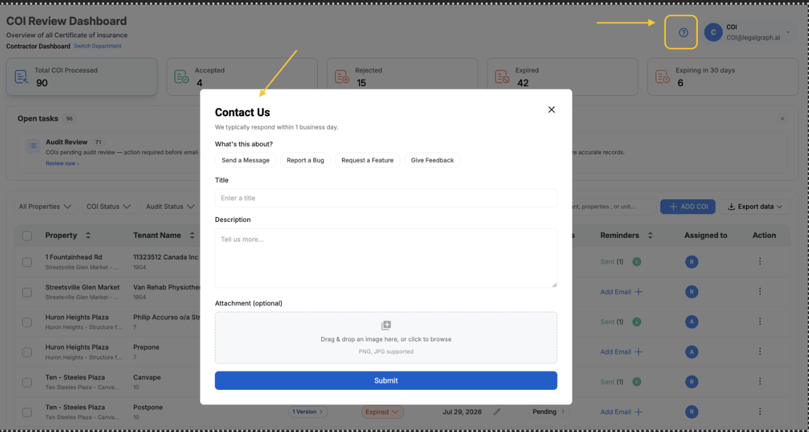

# Welcome to LegalGraph COI

## Customer Onboarding Guide

This guide walks you through everything that happens between the day you decide to move forward with LegalGraph COI and the day your COI Dashboard goes live.

## Typical Timeline

Most customers are fully onboarded — accounts created, data loaded, reminders confirmed, and team trained — within 1 to 2 weeks of signing up. Your timeline may vary depending on how quickly checklist and data details are shared with us.

## What to Expect

Onboarding happens in three simple phases:

| Phase | What happens | Who's involved |
|---|---|---|
| 1. Tell us about you | You share account emails, your COI checklist, your property/tenant data, and your reminder preferences. | You (Admin) and your LegalGraph contact |
| 2. We build your Dashboard | We create your accounts, connect your COI inbox, load your data, and set up your reminder emails. | LegalGraph Setup Team |
| 3. Train & go live | We walk your team through the Dashboard in a live training session, then switch everything on. | You, your Property Admins, and LegalGraph |

## Before You Begin: What You'll Need to Prepare

Gathering these ahead of time will help your onboarding go quickly. We'll explain each one in detail in the steps below.

- Email address for your Admin account (usually a Department head/Property Manager)
- Email address(es) for your Property Admin account(s) — skip this if you're starting with a single user/license
- Access to your Microsoft 365 / Entra ID admin to set up the COI Agent mailbox (or your IT contact's details)
- Your COI compliance checklist — the rules used to decide if a Certificate of Insurance is compliant or non-compliant
- Your tenant/contractor and COI data — either our Excel template filled in, or access to add it manually, or your Yardi/MRI details for an integration (**[COI Data import excel template](https://pragyaallc-my.sharepoint.com/:x:/g/personal/rajat_legalgraph_ai/IQA0-m3zDop_So5HZjDDWzQFASiOt-DDijIgOwCn81UIXRs?e=GHlRgp)**)
- Your preferred tone and frequency for reminder emails
- A time that works for your team's training session

## Your Onboarding Journey

Follow these steps in order. Your LegalGraph contact will guide you through each one and let you know what's needed next.

### 1. Book a Demo & Get Started

Visit the **[LegalGraph website](https://legalgraph.ai/#request-demo)** and use the "Contact Us" or "Book a Demo" option. On the meeting, we'll walk you through the COI Agent, answer your questions, and confirm it's the right fit for your team.

Once you decide to move forward, we'll confirm your plan and the next steps begin.

### 2. Confirm Your Plan & User Roles

LegalGraph COI uses role-based access, so before we create accounts we need to know how your team will use the Dashboard:

| Account type | Who it's for | What they can do |
|---|---|---|
| Admin | A department head or property manager or the person overseeing the whole COI program | Sets up the COI checklist, assigns properties to Property Admins, manages reminder settings, and sees all properties |
| Property Admin | The person managing day-to-day COI compliance for specific properties | Reviews and tracks COIs, sends reminders, and manages compliance for their assigned properties |
| Single user (one license) | Teams starting with just one person using the Dashboard | Has full access with no role split — this account can do everything, and Admin/Property Admin roles aren't used |

> **Note:** If you only need one person to use the Dashboard for now, just let us know — we'll set up a single account with no role-based access, and you can add role-based accounts later if your team grows.

### 3. Set Up Your Team Accounts

Share the following with your LegalGraph contact:

- Email address for your Admin account
- Email address(es) for each Property Admin (if applicable)

We'll create these accounts and email each person their login instructions directly.

### 4. Connect Your COI Inbox (COI Agent Email)

The COI Agent is the automated mailbox (AI Agent) that reads incoming Certificates of Insurance from tenants and contractors and adds them to your Dashboard automatically. To connect it, we need:

- The COI Agent email address (e.g. coi@yourcompany.com)
- The mailbox password
- Your email Tenant ID
- The Client ID
- The Client Secret Key

These last four items are generated by your Microsoft 365 / Entra ID administrator. We've prepared a separate step-by-step guide for whoever handles this on your side.

**[Link to step-by-step guide](https://pragyaallc-my.sharepoint.com/:b:/g/personal/rajat_legalgraph_ai/IQCiwTY9B9lIQ4nJ3Hxi1sABAep377nUzQSQNY1BPy18t8A?e=tYLTIG)**

> **Who should do this:** This step is usually handled by your IT team or Microsoft 365 administrator, not the property team — feel free to forward the attached guide directly to them.

### 5. Share Your COI Compliance Checklist

This is the list of rules our AI uses to review each Certificate of Insurance and decide whether it's compliant or non-compliant (for example, minimum coverage amounts, required endorsements, or who must be listed as certificate holder).

Share your existing checklist in whatever format you have it — a document, spreadsheet, or even your lease language — and we'll configure it in your Dashboard. If you don't have a formal checklist yet, we can start from our standard real-estate COI checklist and customize it with you.

**[Link to sample checklist](https://pragyaallc-my.sharepoint.com/:x:/g/personal/rajat_legalgraph_ai/IQBD6Rfa8I1FSYeIL--vGhWFATWiyT-tE600pnaq-jLP2gA?e=dfLCqr)**

### 6. Add Your Property, Tenant & Contractor Data

Next, we populate your COI Dashboard with your properties, tenants/contractors, and their current COI records. There are three ways to do this — pick whichever is easiest for you:

- **Excel template.** Fill in the template we provide and send it back to us. We'll upload it for you. (**[COI Data import excel template](https://pragyaallc-my.sharepoint.com/:x:/g/personal/rajat_legalgraph_ai/IQA0-m3zDop_So5HZjDDWzQFASiOt-DDijIgOwCn81UIXRs?e=GHlRgp)**)
- **Manual entry.** Add records directly in the Dashboard yourself, at your own pace. (**[User Guide](https://pragyaallc-my.sharepoint.com/:b:/g/personal/rajat_legalgraph_ai/IQBN47qBYPTpR7QodvnV4NnJAUwYuWrQhcqNLeK-9X7kraY?e=GRcYeJ)**)
- **Integration sync.** If you already track this data in Yardi, MRI, or a similar tool, we can connect an integration that pulls your data in automatically and keeps your Dashboard in sync going forward.

If you're using the Excel template, it includes these columns:

| Property Name | Tenant Name | Tenant Email | Unit | COI File | COI Expiry Date |
|---|---|---|---|---|---|
| 100 Main St | Acme Bakery | manager@acmebakery.com | Suite 4B | acme_coi_2026.pdf | 12/31/2026 |

### 7. Confirm Your Reminder Email Settings

LegalGraph COI automatically emails tenants and contractors to keep their insurance compliant. Before we turn this on, we'll confirm the wording and schedule with you for three types of reminders:

- **COI Expiring** — sent before a certificate's expiry date
- **COI Expired** — sent after a certificate has lapsed
- **COI Rejection** — sent when a submitted COI is missing required coverage

You'll also choose how often reminders go out:

| Frequency option | Best for |
|---|---|
| Daily | High-urgency portfolios that need fast follow-up |
| Weekly | Most teams — a steady, low-noise cadence |
| Bi-weekly | Smaller portfolios or lower-risk tenants |
| Monthly | Long lead-time renewals or low-volume properties |
| Custom | Any schedule specific to your properties or lease terms |

> **Note:** This is a one-time setup during onboarding to get you started. Once you're live, you (or any Admin) can update the wording or frequency of any reminder at any time from COI Settings in the Dashboard — no need to contact us.

### 8. Training & Walkthrough Session

Once your accounts, checklist, and data are set up, we'll schedule a live training session with your team. We'll cover:

- A full tour of the COI Dashboard
- How to upload, review, and approve or reject a COI
- How reminders work and how to send one manually
- How to update your checklist, reminder settings, and property assignments
- Answers to any questions from your team

We recommend your Admin and all Property Admins attend, so everyone starts off comfortable using the Dashboard.

### 9. Go Live

Once training is complete and you've confirmed your Dashboard data looks correct, we switch everything on — your COI inbox starts processing certificates automatically, and reminder emails begin going out on your chosen schedule.

You'll receive a confirmation once you're fully live, along with your Dashboard login link.

## After You Go Live

Onboarding doesn't end when you go live — you're always in control of your setup. From the Dashboard's COI Settings, any Admin can:

- Update reminder email wording or frequency
- Adjust your compliance checklist
- Add or reassign properties and Property Admins
- Add new tenants, contractors, or properties at any time

If you run into any issues or have questions after go-live, your LegalGraph account contact and our support team are always available at **[info@legalgraph.ai](mailto:info@legalgraph.ai)**.

## Quick Reference: Onboarding Checklist

Use this as a one-page summary to track your progress.

| Step | What we need from you | Done? |
|---|---|---|
| 1. Get started | Book a demo, agree to move forward | ☐ |
| 2. Plan & roles | Confirm seats and Admin / Property Admin structure | ☐ |
| 3. Team accounts | Admin email + Property Admin email(s) | ☐ |
| 4. COI inbox | COI Agent email, password, Tenant ID, Client ID, Secret Key | ☐ |
| 5. Checklist | Your COI compliance checklist | ☐ |
| 6. Property & COI data | Filled Excel template, manual entry, or integration access | ☐ |
| 7. Reminder settings | Approved email wording + chosen frequency | ☐ |
| 8. Training | A confirmed time for your team's walkthrough | ☐ |
| 9. Go live | Final review and sign-off | ☐ |

## Need Help?

If anything in this guide is unclear, or you run into an issue at any point during onboarding, reach out to your LegalGraph account contact, or email us directly.

Our contact details:

- **Contact person:** Rajat Sharma
- **Email:** **[rajat@legalgraph.ai](mailto:rajat@legalgraph.ai)**
