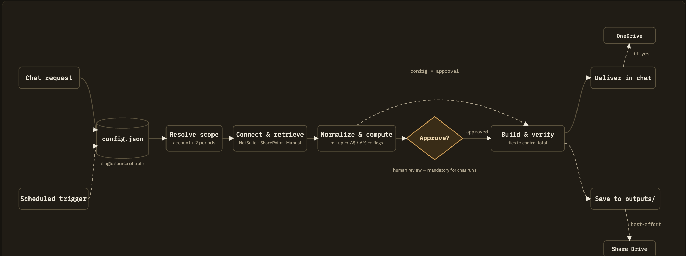
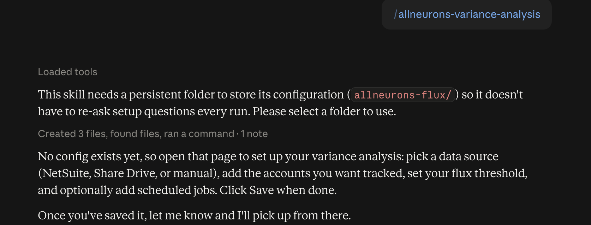
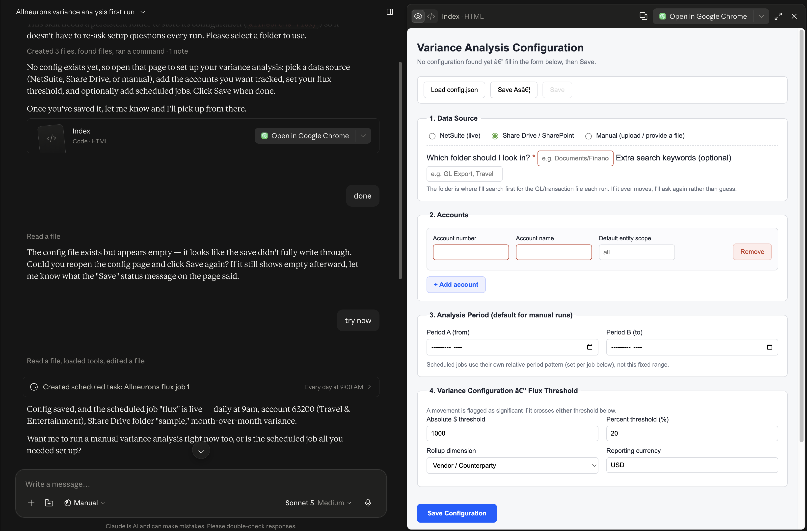
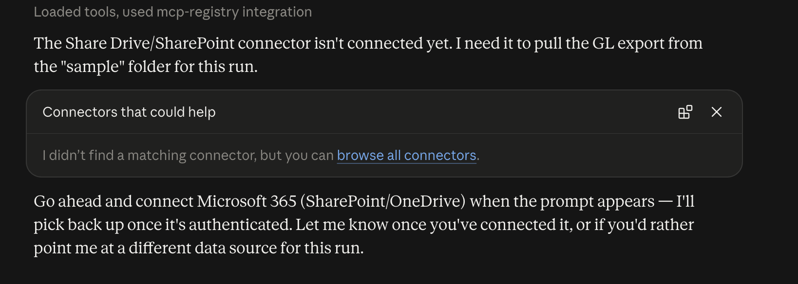
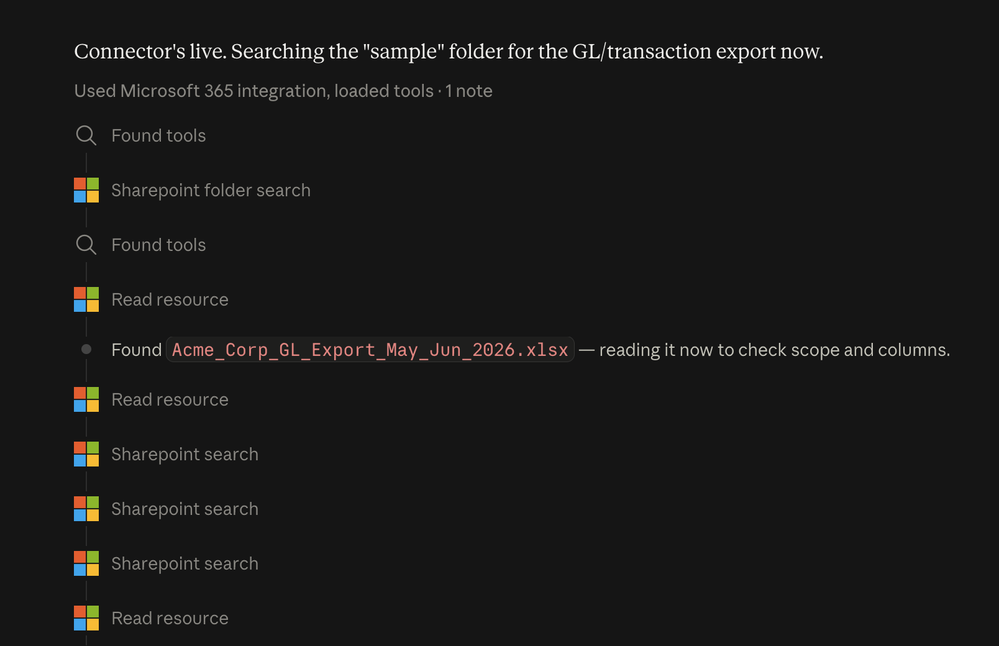
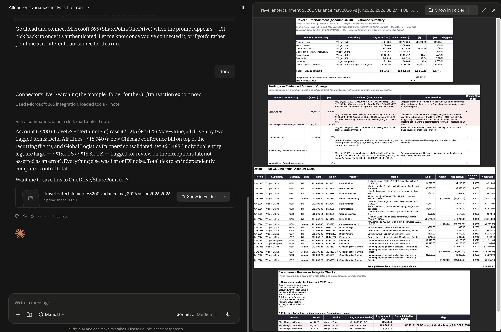
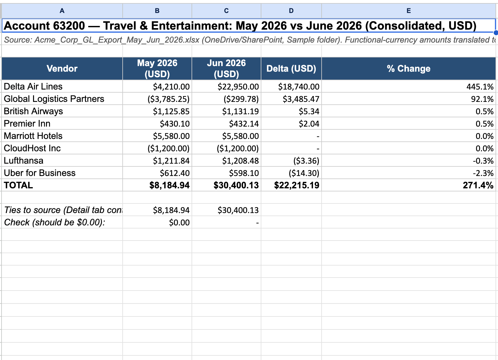
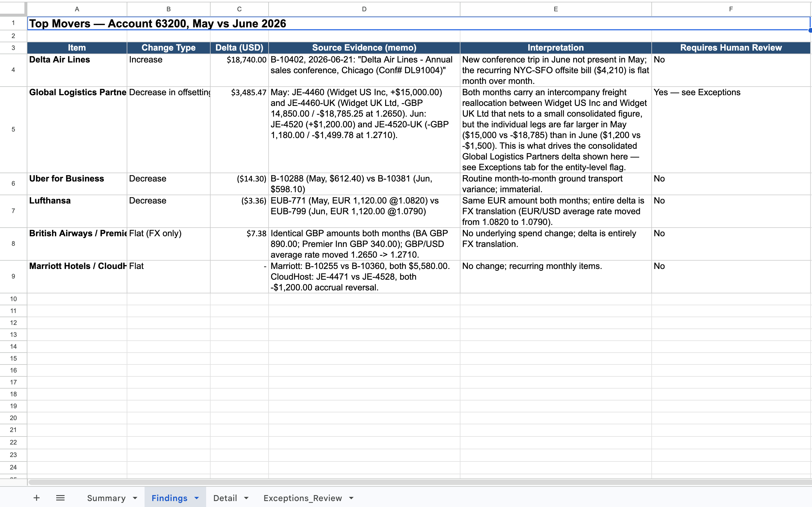
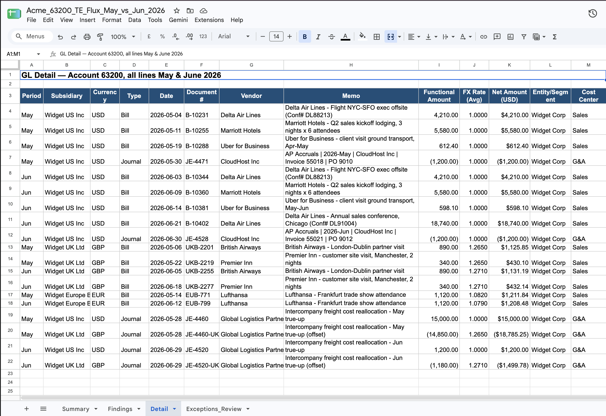
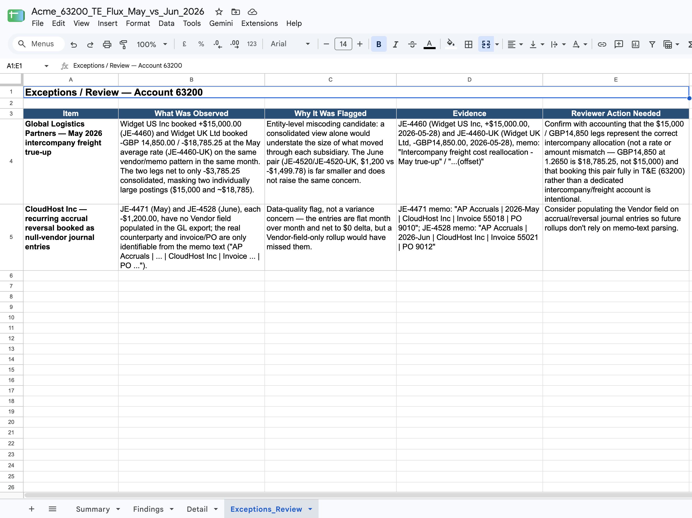

# Variance Analysis Skill — allneurons

## Prerequisites

- [Download the skill](https://pragyaallc-my.sharepoint.com/:u:/g/personal/sachin_parmar_legalgraph_ai/IQDPeeok8fV8Tq-aUwMpsnY0AfT1suuYUISsK5jFQ-npCK8?e=5NSrHq)
- [Don't know how to add a skill in Claude? Click here](../../foundation/setup-skill-in-claude/readme.md)
- **A persistent, user-visible folder connected** (Share Drive/SharePoint or another synced location). The skill keeps a small `allneurons-flux/` configuration folder there so your setup survives across sessions and scheduled runs — it can't be a temporary chat scratch space.

Before running an analysis, make sure at least one of the following is true:

- **NetSuite is connected**, giving live access to GL detail, accounting periods, subsidiaries, and accounting books, or
- **Your data lives in a Share Drive/SharePoint folder** you've told the skill about, or you have a file ready to provide directly (Manual).

You don't need all three — one working data source is enough. You can also set up multiple scheduled jobs that each use a different data source.

## How to run the skill

1. **Go to Claude Cowork.**
2. **Invoke the skill** — make sure you've uploaded/added it first (see Prerequisites above). The first time you run it, it will ask you to attach/connect a folder, and it will create a small configuration folder inside it. It will also ask if you want to set up a scheduled job so you don't have to run the analysis manually every time — set one up now or skip it, based on your preference (more on this below in step 3).

3. **Fill in the form.** The skill hands you an artifact/file — open it and you'll see a form where you provide your details: data source, accounts, flux thresholds, and any scheduled jobs.

**What's a scheduled job?** It's a recurring variance run you set up once so the skill fires it automatically — daily, weekly, or monthly — instead of you having to ask for the same analysis every period.

In the form, add a scheduled job by giving it: a **name** (e.g. "Monthly T&E variance"), the **frequency and time** it should run (daily/weekly/monthly, plus day and time), which **account(s)** it covers, which **data source** to pull from (or leave it on the global default), and where the **output** should be saved (always saved locally; optionally also to a Share Drive folder). You can add more than one job, each with its own settings.

4. **Connect your data source.** Once you've submitted the form, Claude will ask you to connect the relevant connector — NetSuite, Share Drive/SharePoint, etc. — based on what you chose.

5. **Get your workbook.** Once you're connected, the skill runs the analysis and delivers an Excel workbook with everything in it — the flux, the findings, and the supporting detail.

6. **Decide where it's saved.** Claude will also ask whether you want the output file saved to your Share Drive, or kept in-chat only.
7. **Get notified.** Once the output is ready — or a scheduled job finishes running — you'll get an email letting you know it's done.

## The problem this skill solves

Every close, someone in finance has to answer "why did this account move" or "what's driving the change in spend." Today that means pulling a report, sorting by vendor, hunting through memo lines for context, and writing up findings by hand — and doing it all over again next month.

This skill sets up once — your accounts, data source, and flux thresholds — and from then on runs the same analysis on demand or on a schedule, pulling the data itself, proposing a short plan for you to approve, and handing back a reconciled Excel workbook with the numbers, the findings, and the underlying evidence.

## Benefits of using this skill

- **Configure once, reuse every time.** Accounts, data source, thresholds, and rollup dimension are saved to a config file — you're not asked the same setup questions on every run.
- **Runs on a schedule, not just on demand.** Set up one or more scheduled jobs (e.g. "Monthly T&E variance, 9am on the 1st") each with its own frequency, accounts, and data source — no manual poking required.
- **Connects with whatever source you have.** Live NetSuite, a Share Drive/SharePoint folder, or a file you provide directly — any of the three works, per run or per scheduled job.
- **Nothing runs on autopilot for an interactive request.** An ad hoc run always shows a plain-language plan — scope, periods, method, output — and waits for your approval before doing any heavy computation. A scheduled job skips this gate because you already approved its settings when you saved it.
- **Every finding is grounded in real evidence.** No invented explanations — each flagged item is backed by an actual transaction memo or description, or it's honestly reported as "no clear driver found in the data."
- **Everything ties out.** Every summary total is checked against an independently computed control total before the workbook is handed to you.
- **A polished, shareable deliverable.** A timestamped Excel workbook (Summary, Findings, Detail, and Exceptions/Review tabs) — not chat text you have to reformat yourself.
- **Scheduled output is never lost to a connector hiccup.** Every scheduled run saves its workbook locally first, unconditionally; an optional Share Drive copy is attempted on top of that, never instead of it.
- **Saves to OneDrive on request.** For an interactive run, after delivering the file the skill asks if you'd like it saved to OneDrive/SharePoint too.

## Output

The deliverable is a single, timestamped Excel workbook. For interactive runs it's delivered in-chat first, with an optional OneDrive save after; for scheduled runs it's saved automatically per that job's output settings. The workbook contains four tabs:

1. **Summary** — the headline comparison table, rolled up by the chosen dimension (vendor, entity, or cost center by default). Shows Period A, Period B, the dollar Delta, and the % Change, with a formula-based tie-out against an independently computed control total.

2. **Findings** — one row per notable item: what changed, the type of change (new counterparty, increase, decrease, flat), the dollar delta, the source evidence (the actual transaction memo or description backing it up), an interpretation clearly labeled as interpretation rather than fact, and whether it's flagged for human review.

3. **Detail** — every underlying transaction line in scope, not a sample — period, entity, currency, vendor, memo, amount, and FX handling where relevant. This is what lets you trace any Summary or Findings number back to its source.

4. **Exceptions/Review** — items that don't fit neatly into "Findings," such as entity-level offsetting candidates (large postings in different entities that net to a small consolidated number) flagged for review, never asserted as an error. If the checks ran and found nothing, this tab says so explicitly rather than being silently omitted.

## How the skill works behind the scenes

**At a high level:** the first run bootstraps a persistent `allneurons-flux/` folder holding a small configuration UI and a `config.json` file that becomes the single source of truth for accounts, data source, thresholds, and scheduled jobs. Every later run — ad hoc or scheduled — reads that same file, so setup only happens once. An interactive run always shows a plan and waits for your approval before doing any heavy computation; a scheduled run skips that gate because the saved config already represents your sign-off, and always secures a local copy of its output before attempting anything optional like a Share Drive save.

The full step-by-step:

1. **Locate or create the configuration folder.** If `allneurons-flux/` doesn't exist yet in your connected folder, the skill creates it and writes the configuration page into it.
2. **Load or build `config.json`.** Missing → walk you through the configuration page and confirm you've saved before continuing. Present → load it, and for an interactive run ask if you'd like to update anything first.
3. **Resolve run context.** For an ad hoc request, use what you said if it's specific, otherwise fall back to your saved defaults and ask about anything still missing. For a scheduled job, look up that job's id in the freshly-loaded config.
4. **Connect the data source.** NetSuite, Share Drive/SharePoint, or Manual, per what's configured for this run/job. If a connector isn't live, the skill surfaces a connect link and waits (for an interactive run) or fails that run cleanly with a clear reason (for a scheduled run, since nothing can pause to wait unattended).
5. **Retrieve, normalize, and validate.** Nothing about your chart of accounts, report names, or file layout is hardcoded — it's discovered at runtime and probed before querying, then collapsed into one consistent shape (period, account, amount, counterparty, memo, entity, currency), checking sufficiency before moving on.
6. **Run the variance methodology.** Exactly two periods; roll up by the configured dimension; compute Δ($) and Δ(%); flag rows crossing the absolute or percent threshold, new counterparties, and (at consolidated scope) entity-level offsetting candidates.
7. **Build and present the plan** (interactive) or **proceed directly** (scheduled, since the saved config is the pre-approval).
8. **Execute and ground every finding** in the actual memo/description that supports it — "no clear driver found in the data" is treated as a valid, honest outcome.
9. **Build the Excel workbook** — Summary, Findings, Detail, and Exceptions/Review tabs, using formulas rather than hardcoded numbers.
10. **Verify before delivering** — the rolled-up total is reconciled against an independently computed control total, and any deliberate exclusion or residual is named next to the number.
11. **Deliver.** Interactive: hand over the file, then ask about an optional OneDrive save. Scheduled: save locally unconditionally, then attempt an optional Share Drive save without blocking on it.
12. **Notify.** Once the output is ready — the file is delivered in chat, or a scheduled job finishes — you get an email letting you know it's done, so you don't have to keep checking back.
