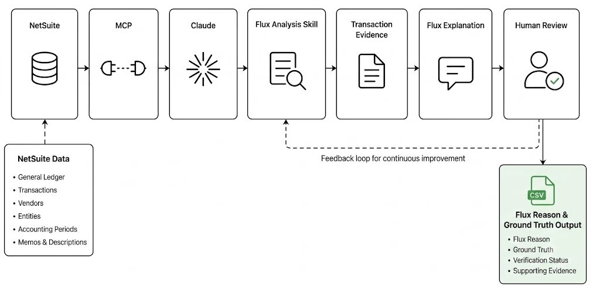
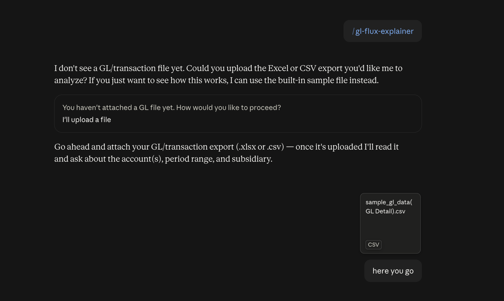
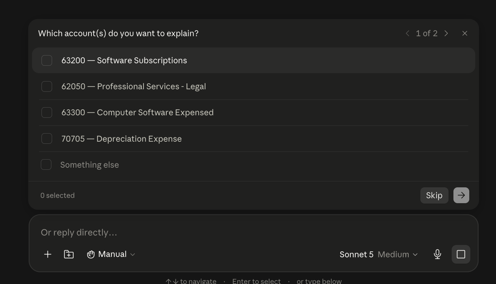
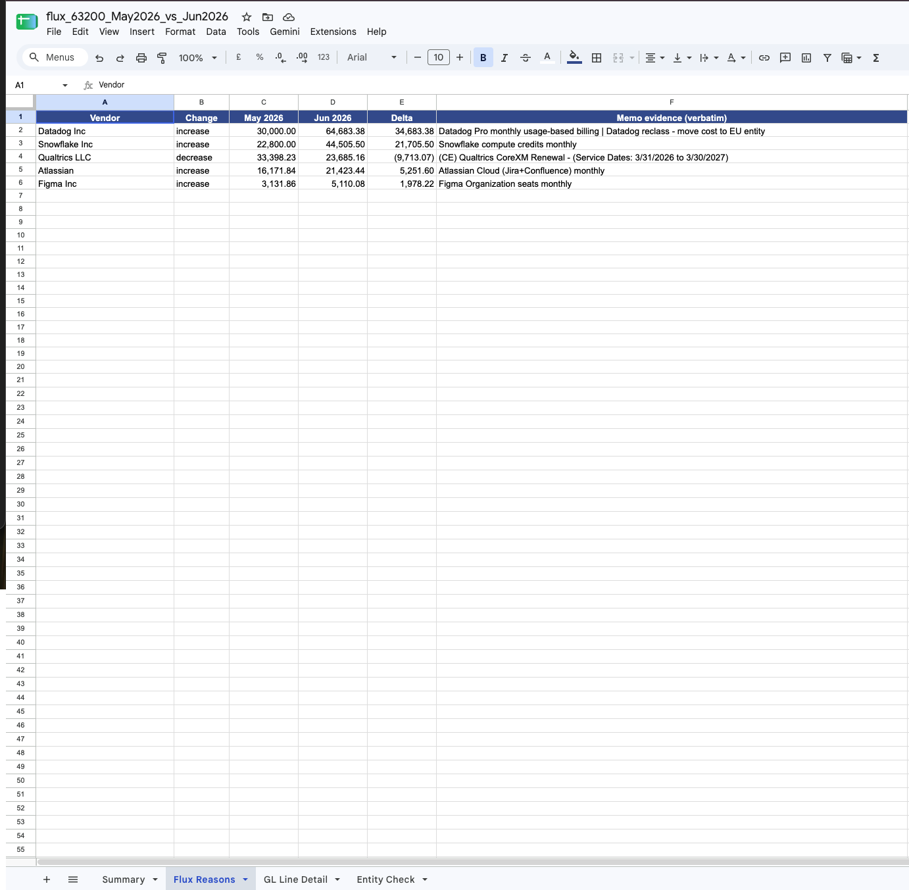
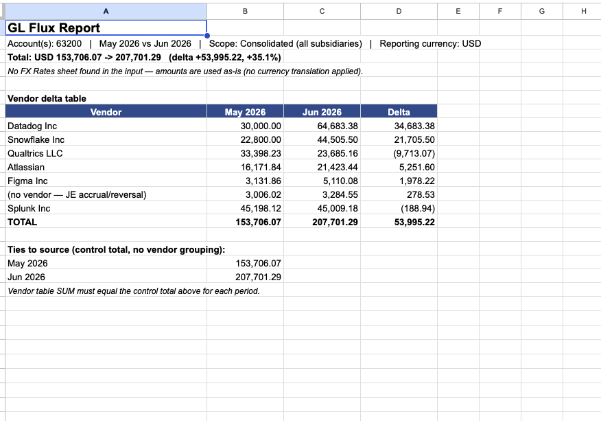
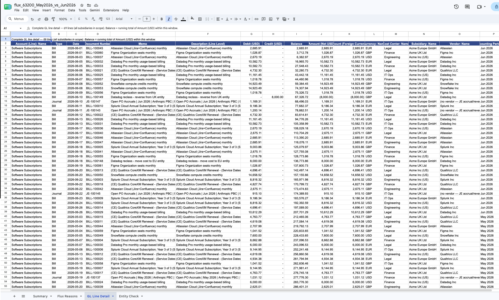
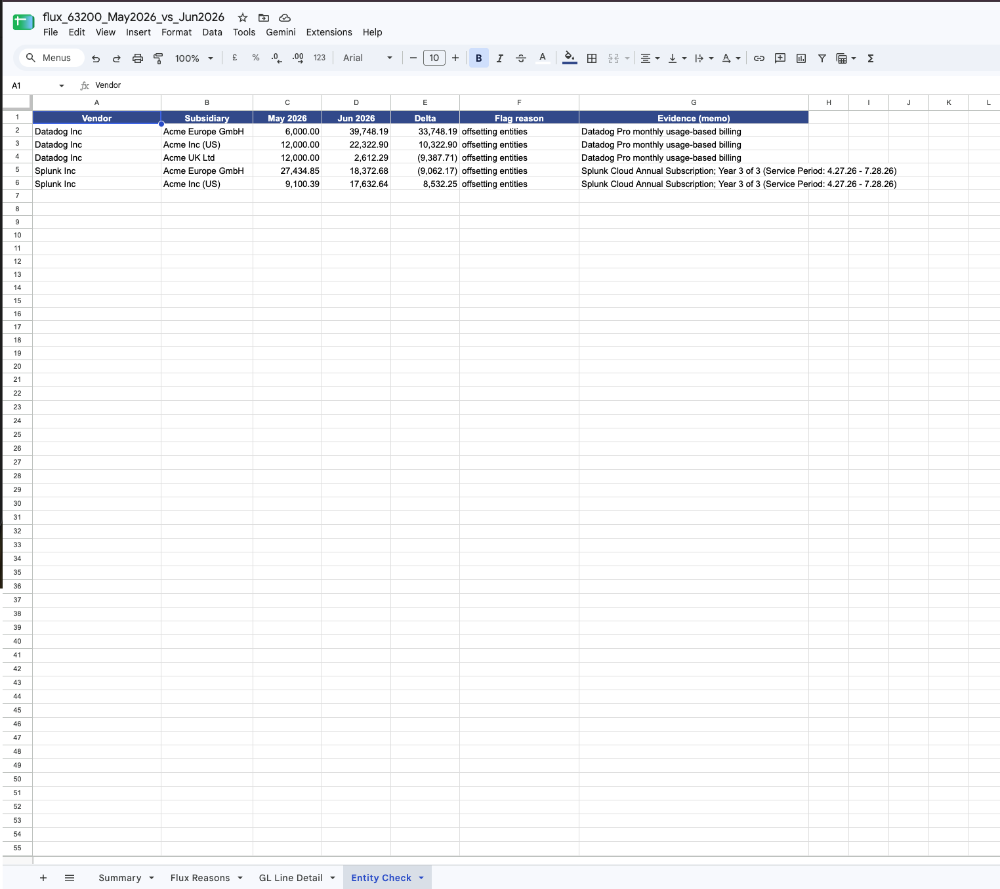

# GL Account Flux Explainer

## Download

- [Download the Skill](https://pragyaallc-my.sharepoint.com/:t:/g/personal/sachin_parmar_legalgraph_ai/IQDPHZDlmVkWSYXVHt04gRHCAdLdjTwOiHgFSYKoEkw9IUA)
- [Download the Sample Data](https://pragyaallc-my.sharepoint.com/:x:/g/personal/sachin_parmar_legalgraph_ai/IQDiMlGrJpeqToN5KId0SM9cARgT8uqdDWHE_9qlrBRpWSk?e=7ntjIw)
- [Don't know how to add a skill in Claude? Click here](../../foundation/setup-skill-in-claude/readme.md)

---

Explain **what drove the change in a general-ledger account between two periods** — straight
from a spreadsheet export. Upload a GL/transaction file, answer three questions (which
account, which two periods, which subsidiary), and get back a formatted Excel workbook that
names the vendors behind the move and quotes the memo text that proves it.

No accounting system, database, or connection required. The spreadsheet you upload *is* the
data source, so anyone can run it on their own export.

## Solving Flux

Every month, someone in finance has to answer **"why did this account go up $61K?"** The honest answer lives in the general ledger — which vendor moved, whether a contract is new or cancelled, what the line memo actually says — but digging it out by hand means pivoting a messy export, eyeballing hundreds of lines, and manually reconciling currencies and entities. People often end up guessing a plausible-sounding reason instead of grounding it in the data.

This skill does that dig automatically and, crucially, **won't invent a reason the data doesn't support**. Every driver it reports is tied to a real transaction and a quoted memo.

It also catches two mistakes that silently corrupt manual flux analysis:

- **Mixed-currency totals** — summing GBP + EUR + USD as if they were one unit. The skill translates each subsidiary to one reporting currency at its own rate first.
- **Entity-level miscoding** — a +$400K in one entity offset by −$400K in another, netting to near-zero at the consolidated level so it looks fine. The skill re-checks by entity and flags these for review.

## What you get

An Excel workbook with:

- **Summary** — the headline number, the full vendor delta table, and a reconciliation line
  proving the total ties to the source.
- **Flux Reasons** — the top movers, each with the verbatim memo that explains it.
- **GL Line Detail** — every line in scope, in a standard GL-detail layout, in one reporting
  currency, with a running balance.
- **Entity Check** — (consolidated runs) any vendor whose movement looks like it was booked to
  the wrong entity, flagged for review.

## How to use it

1. **Have a GL export ready** as `.xlsx` or `.csv`. It needs, at minimum, columns for
   accounting **period**, **account number**, **subsidiary**, and an **amount** (or Debit +
   Credit). A **memo/description** column is what makes the "reasons" useful, and a **vendor**
   column lets it roll up by vendor. Column names don't have to be exact — the skill
   auto-maps common variants (Vendor/Supplier/Payee, Amount/Net Amount, Entity/Company, etc.).
   See `assets/sample_gl_data.xlsx` for the expected shape.

2. **Ask for a flux report**, e.g. *"Why did account 63200 move from May 2026 to June 2026?"*
   or *"Run a variance report on accounts 63200 and 63300, all subsidiaries."* The skill asks
   only for whatever you didn't specify:
   - **Account(s)** — one, or several to combine into one flux ("group").
   - **Period range** — a base period and a compare period.
   - **Subsidiary** — `ALL` (consolidated, the default) or one entity.

3. **Get the workbook back.** You'll see a one-line headline in chat and a downloadable file.

### Try it now

1. **Run the skill** in your AI assistant (Claude, etc.) after installing `SKILL.md`.
2. **Upload the sample data file** — use `assets/sample_gl_data.xlsx` provided in this repo.

3. **Select an account** — pick any account number from the sample (e.g. `63200`) for which you want to calculate the flux.

4. **Choose your subsidiary scope** — enter a specific entity name or `ALL` for a consolidated view across all subsidiaries.
5. **Get your output** — the skill returns a CSV file containing the reasons behind the flux: which vendors drove the change, by how much, and the memo text that proves it.

## Files

The skill itself is a **single self-contained file** — `SKILL.md` — which includes the full
engine code inline (Appendix A). The rest are companion files provided separately:

- `SKILL.md` — the skill. Instructions the assistant follows, with the complete engine
  embedded in Appendix A (no external script needed). Requires `pandas` and `openpyxl` at run
  time.
- `assets/sample_gl_data.xlsx` — a realistic multi-vendor, multi-subsidiary example you can run
  immediately to see the output format (includes an FX Rates sheet).
- `flux_63200_May2026_vs_Jun2026.xlsx` — an example of the output the skill produces.

## Output file structure

The skill produces an Excel workbook with four sheets. Here is exactly what each one contains, based on a real output (`flux_63200_May2026_vs_Jun2026.xlsx`):

---

### Sheet 1 — Summary

A header block followed by a vendor delta table.

| Row | Content |
|---|---|
| 1 | Report title |
| 2 | Scope line: account(s), period range, subsidiary filter, reporting currency |
| 3 | Headline: opening total → closing total, delta amount, delta % |
| 4 | FX note (whether currency translation was applied) |
| 6+ | Vendor delta table — one row per vendor with May amount, June amount, and delta |

**Example headline:** `Total: USD 153,706.07 → 207,701.29 (delta +53,995.22, +35.1%)`

---

### Sheet 2 — Flux Reasons

The top movers, each grounded in verbatim memo text pulled from the GL.

| Column | Description |
|---|---|
| Vendor | Vendor name |
| Change | `increase` or `decrease` |
| May 2026 | Total spend in base period |
| Jun 2026 | Total spend in compare period |
| Delta | Difference (positive = increase) |
| Memo evidence (verbatim) | Exact memo text from the GL lines that explain the move |

**Example row:** Datadog Inc — increase — $30,000 → $64,683 (+$34,683) — *"Datadog Pro monthly usage-based billing | Datadog reclass - move cost to EU entity"*

---

### Sheet 3 — GL Line Detail

Every individual GL transaction line in scope, in one reporting currency, with a running balance. 16 columns:

| Column | Description |
|---|---|
| Account (Line): Name | Account name |
| Type | Transaction type (e.g. Bill) |
| Date | Transaction date |
| Document Number | Bill/journal number |
| Memo | Header-level memo |
| Description (Line Level) | Line-level description |
| Debit (USD) / Credit (USD) | Gross debit and credit in reporting currency |
| Balance | Running total of net amount within this window |
| Amount (Net USD) | Net amount in reporting currency |
| Amount (Foreign Currency) | Original amount in the subsidiary's currency |
| Currency: Name | Source currency (USD, EUR, GBP, etc.) |
| Cost Center: Name | Cost center |
| Subsidiary: Name | Entity (e.g. Acme Europe GmbH) |
| Vendor: Name | Vendor |
| Accounting Period: Name | Period (e.g. Jun 2026) |

---

### Sheet 4 — Entity Check

Flags vendors whose movement looks like it may be miscoded across entities — a movement in one subsidiary is offset by a reverse movement in another, netting near-zero at the consolidated level.

| Column | Description |
|---|---|
| Vendor | Vendor name |
| Subsidiary | Entity where the anomaly was detected |
| May 2026 / Jun 2026 | Period totals for this vendor × entity |
| Delta | Movement at the entity level |
| Flag reason | Why it was flagged (e.g. `offsetting entities`) |
| Evidence (memo) | Verbatim memo from the flagged lines |

**Example:** Datadog Inc shows +$33,748 in Acme Europe GmbH but −$9,388 in Acme UK Ltd in the same period — flagged for review.

---

## What it deliberately does *not* do

- It won't guess a driver a memo doesn't support.
- It won't assert a booking error is confirmed — entity anomalies are flagged "for review".
- It doesn't connect to any accounting system; it only reads the file you give it.