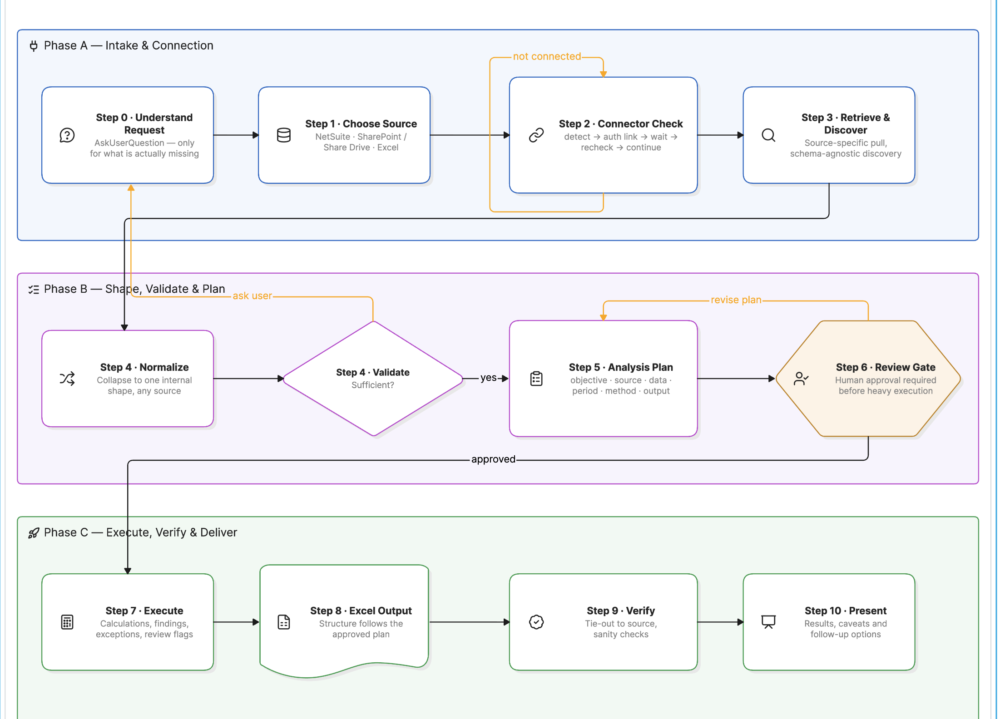
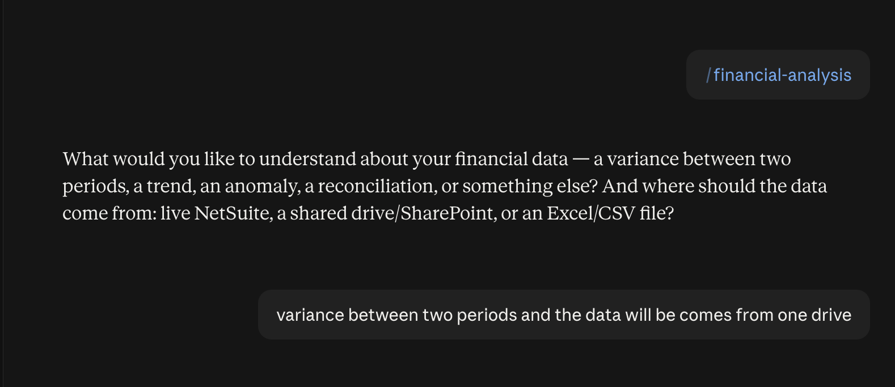
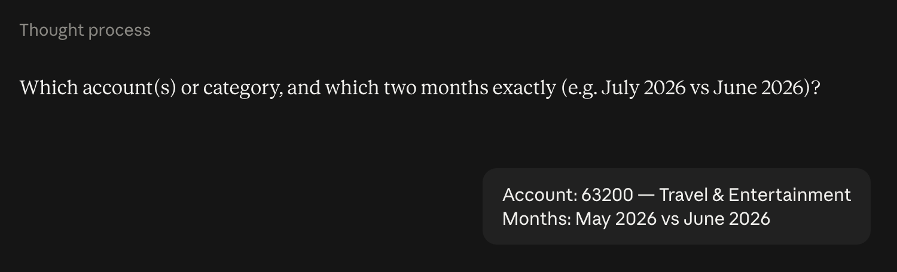
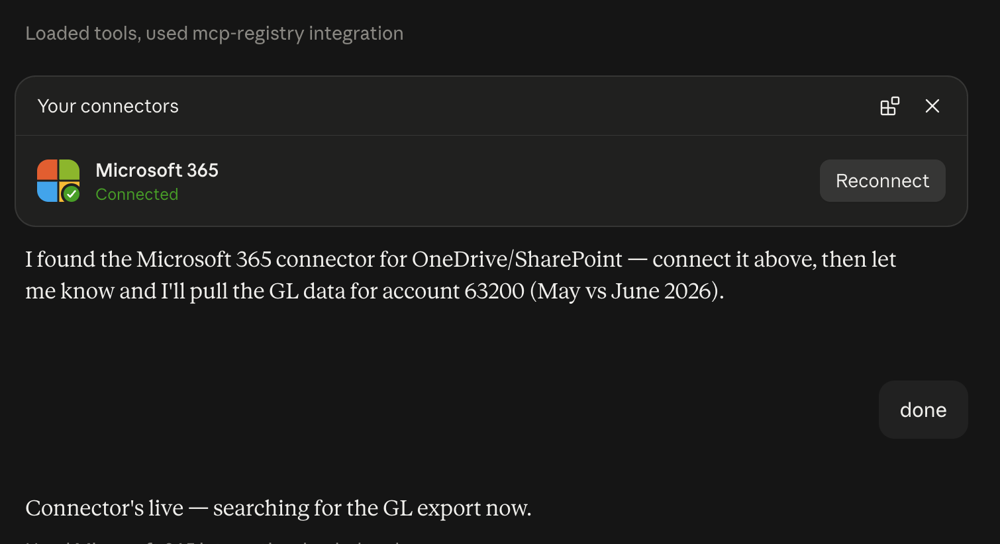
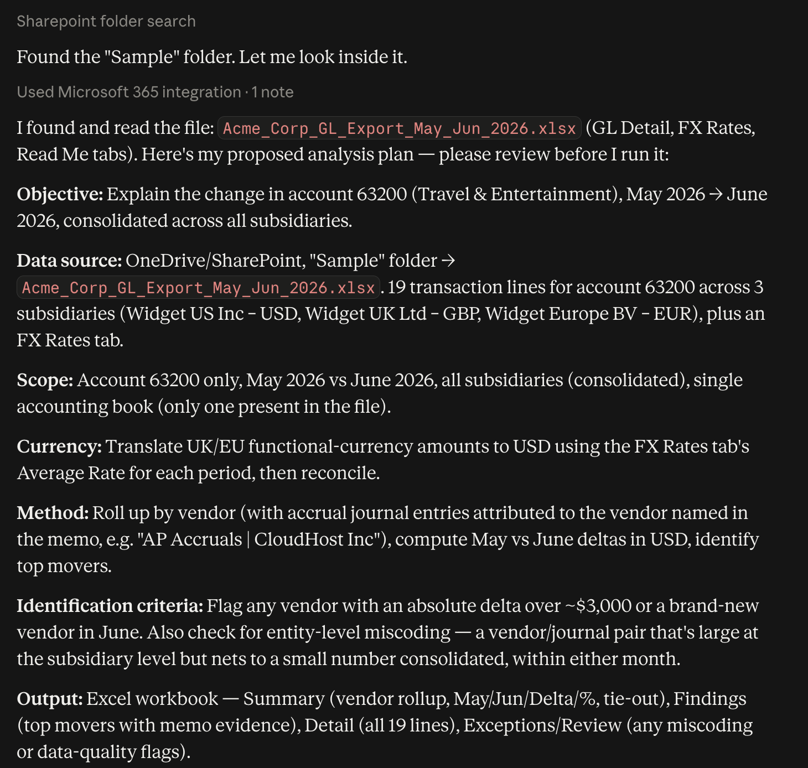
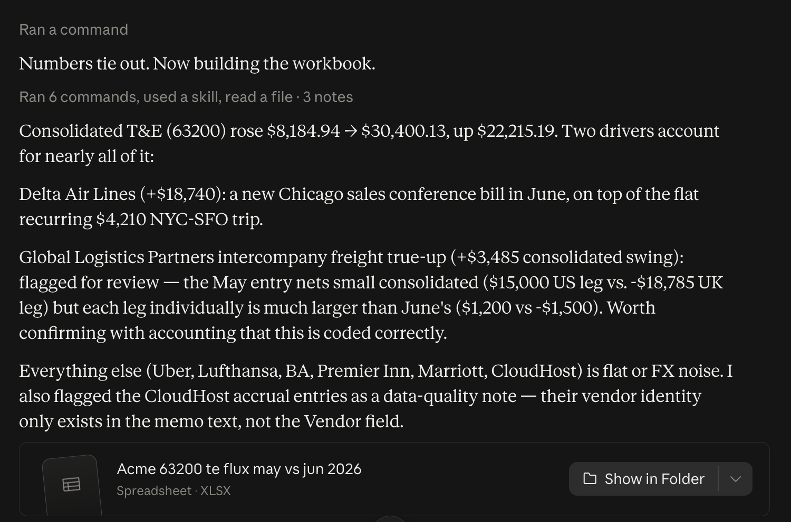

# Financial Analysis Skill — allneurons

## Prerequisites

- [Download the skill](https://pragyaallc-my.sharepoint.com/:u:/g/personal/sachin_parmar_legalgraph_ai/IQCtP-MgpWL9TLufMMIrzP55AVZ4mTSjTHIr2LgjzbJov2A?e=zKlHf6)
- [Don't know how to add a skill in Claude? Click here](../../foundation/setup-skill-in-claude/readme.md)

Before running the skill, make sure at least one of the following is true:

- **NetSuite is connected**, giving live access to GL detail, accounting periods, subsidiaries, and accounting books, or
- **Your data lives in OneDrive/SharePoint** (or you have a file ready to upload directly), such as a GL export, trial balance, or similar spreadsheet.

You don't need both — one working data source is enough to run an analysis. Having both connected simply gives you the flexibility to choose per request (see below).

## The problem this skill solves

Every month, someone in finance has to answer questions like "why did this account move," "what's driving the change in spend," or "does this number tie out." Today that means pulling a report, dropping it into a spreadsheet, sorting by vendor, hunting through memo lines for context, and writing up findings by hand — repetitive, slow, and done a little differently by every analyst.

This skill calculates the flux for you and hands back the answer in minutes, not hours. Point it at whatever source you have — live NetSuite or a file on your shared drive — and it pulls the data itself, figures out the shape of it without being told your chart of accounts or report layout, proposes a short analysis plan for you to approve, then runs the analysis and delivers a formatted Excel workbook with the numbers, the findings, and the underlying evidence — all reconciled and ready to send along.

## Benefits of using this skill

- **Calculates the flux for you.** No manually pivoting a GL export or hunting through hundreds of lines to figure out what moved and why.
- **Saves hours every close.** What used to take an analyst an afternoon of copy-pasting and reconciling is done in minutes.
- **Connects with whatever source you have.** Live NetSuite or a file on your shared drive (OneDrive/SharePoint) — either works, no integration required.
- **No manual pulling or copy-pasting.** It retrieves the data directly from NetSuite or your shared drive — you never have to export, download, or reformat anything yourself.
- **Works the same way regardless of source.** Whether the data comes from live NetSuite or a plain Excel export, the analysis method, the plan, and the output are consistent.
- **Nothing runs on autopilot.** You see and approve a plain-language plan — scope, period, method, output — before any heavy computation happens.
- **Every finding is grounded in real evidence.** No invented explanations — each flagged item is backed by an actual transaction memo or description, or it's honestly reported as "no clear driver in the data."
- **Everything ties out.** Every summary total is checked against an independently computed control total before the workbook is handed to you.
- **A polished, shareable deliverable.** You get a formatted Excel workbook (Summary, Findings, Detail, and Exceptions tabs) — not a wall of chat text you have to reformat yourself.

## Connecting both NetSuite and OneDrive

You can have both connectors active at the same time — there's no conflict. When you kick off a request, the skill asks you which source to use for that specific analysis, so you can pull one account from live NetSuite today and analyze an emailed spreadsheet export tomorrow, without reconnecting anything.

**To connect NetSuite:** if it isn't already connected, the skill will detect that and surface a connect/authenticate link automatically the first time you request live data. You don't need to look up or configure the connector yourself — just complete the authentication when prompted.

**To connect OneDrive/SharePoint:** same process — the skill detects whether the connector is active, and if not, surfaces a connect link for Microsoft 365 (which covers OneDrive, SharePoint, Outlook, and Teams). Once connected, the skill can search your shared drive directly and pull the relevant file without you downloading or re-uploading it.

If a connector isn't set up yet, just tell the skill what you want to analyze — it will notice the gap, prompt you to connect, wait, and then continue automatically once you're authenticated.

## How to run the skill

1. **State what you want to understand.** For example: "why did travel and entertainment move between May and June" or "explain the variance in account 63200." You don't need to name a technique — just describe the question in plain language.

2. **Answer a couple of quick clarifying questions**, if anything is ambiguous — typically the account/category, the period(s) being compared, and whether to scope to a specific entity or department.

3. **Pick your data source** — NetSuite (live), OneDrive/SharePoint, or a file you upload directly.

4. **Connect, if needed.** If the chosen source isn't connected yet, follow the prompt to authenticate; the skill picks up automatically once it detects the connection is live.

5. **Review the analysis plan.** The skill will show you exactly what it found (the file or report, the accounts/periods in scope, the currency approach, the method, and the proposed output structure) before doing anything else. Approve it, or ask for changes.

6. **Get your workbook.** Once approved, the skill pulls the full data, runs the analysis, verifies everything ties out, and delivers a formatted Excel file with a plain-language summary of the key findings.

## Output

The deliverable is a single formatted Excel workbook. The exact columns and criteria are proposed in the analysis plan and can be adjusted before the skill runs, but the workbook typically contains four tabs:

1. Summary — the headline comparison table, rolled up by the chosen dimension (usually vendor). Shows Period A, Period B, the dollar Delta, and the % Change, with a TOTAL row and a formula-based tie-out that checks the total against an independently computed control total from the Detail tab — so you can see at a glance that nothing was dropped or double-counted.

2. Findings — one row per notable item: what changed, the type of change (new vendor, increase, decrease, flat), the dollar delta, the source evidence (the actual transaction memo or description backing it up), an interpretation of why it likely moved (clearly labeled as interpretation, not fact), and whether it's flagged as needing human review.

3. Detail — every underlying transaction line in scope, not a sample — period, subsidiary, currency, document number, date, vendor, memo, functional-currency amount, FX rate applied, USD amount, and entity/cost center. This is what lets you trace any Summary or Findings number back to its source.

4. Exceptions / Review — items that don't fit neatly into "Findings," such as entity-level miscoding candidates (two large offsetting postings that net to a small consolidated number) or data-quality issues (like a journal entry with no vendor field populated). Each row states what was observed, why it was flagged, the supporting evidence, and what a reviewer should check. If the review checks ran and found nothing, this tab says so explicitly rather than being silently omitted.

## How the skill works behind the scenes

**At a high level**, the skill runs a five-stage pipeline: it scopes your ask by clarifying only what's actually missing; connects to whatever data source you have (NetSuite, a shared drive, or a direct upload) and auto-detects its shape rather than requiring configuration; normalizes and validates the data before doing anything with it; builds a plan and pauses for your approval before running the real analysis, always tying findings back to an actual transaction memo instead of inventing an explanation; and finally reconciles its own totals before handing you the workbook, staying available for follow-up questions on the same data. In short — it earns trust at each step (ask before guessing, show the plan before computing, reconcile before delivering) rather than acting as a black box that just returns a number.

The full step-by-step:

1. **Understand the request.** It reads what you're asking for and only asks clarifying questions about what's genuinely missing — the objective, the scope, the period(s), and entity/segment boundaries.
2. **Choose and connect the data source.** You pick NetSuite, a shared drive, or a direct file upload. If the relevant connector isn't active, the skill detects that, surfaces a connect link, waits for you to authenticate, and rechecks automatically before continuing.
3. **Retrieve and discover the data's shape.** Nothing about your chart of accounts, report names, or file layout is hardcoded. For NetSuite, it resolves accounts, periods, subsidiaries, and accounting books at runtime and probes the schema before querying. For a file, it auto-maps the columns (period, account, amount, vendor, memo, currency, entity) by inspecting the headers and sample values, and confirms the mapping with you.
4. **Validate.** It checks that what it retrieved is actually sufficient to answer your question — the right period, the right fields, non-empty results — and stops to ask rather than guessing if something critical is missing.
5. **Normalize.** Whatever the source, the data is collapsed into one consistent internal shape (period, account/category, amount, counterparty, memo, entity) so the rest of the analysis works identically regardless of where the data came from.
6. **Build and present a plan.** Before running anything heavy, it lays out the objective, data source, scope, currency/translation approach, analysis method, and proposed output — for you to approve or adjust. This is a hard review gate; nothing large-scale runs before you sign off.
7. **Execute the analysis.** It pulls the full data (not a sample), rolls it up by the relevant dimension (e.g. vendor), computes deltas and percentages, and identifies significant movements using the criteria from the plan. Every numeric value is parsed safely to avoid corrupting unusual figures.
8. **Ground every finding in evidence.** Each flagged item is backed by the actual transaction memo or description that supports it. Findings, interpretations, and review recommendations are kept clearly distinct — an interpretation is never presented as a proven fact, and "no clear driver found in the data" is treated as a valid, honest outcome.
9. **Build the Excel workbook.** Typically a Summary tab (rolled-up comparison with a formula-based tie-out), a Findings tab (top movers with evidence and review flags), a Detail tab (every underlying transaction line), and an Exceptions/Review tab (anything flagged for human follow-up).
10. **Verify before handing it over.** The summary total is reconciled against an independently computed control total, row counts and numeric values are sanity-checked, and any known caveat (an FX residual, an excluded book) is named explicitly rather than left as a silent mismatch.
11. **Present the result.** You get the finished workbook plus a short, plain-language headline of the key findings — and you can keep asking follow-up questions (like "break this down by cost center") against the same data without starting over.