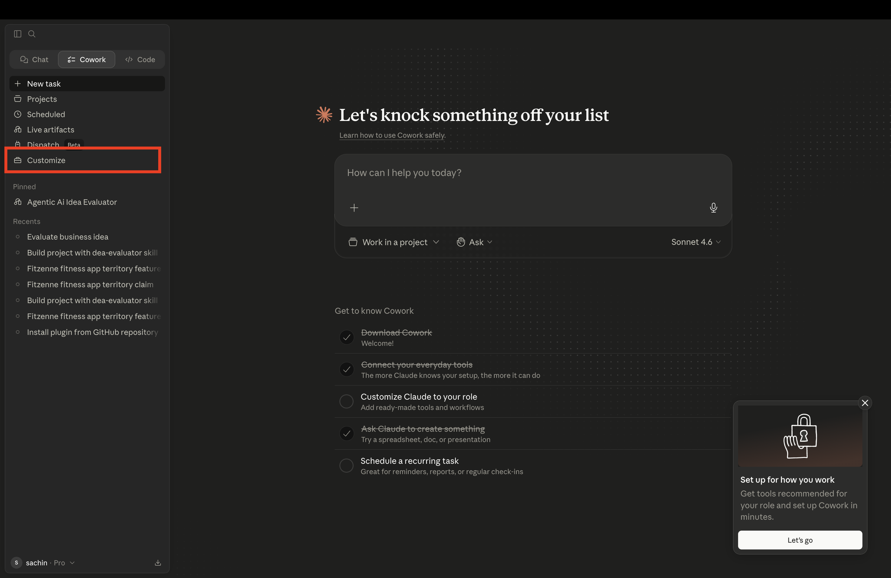
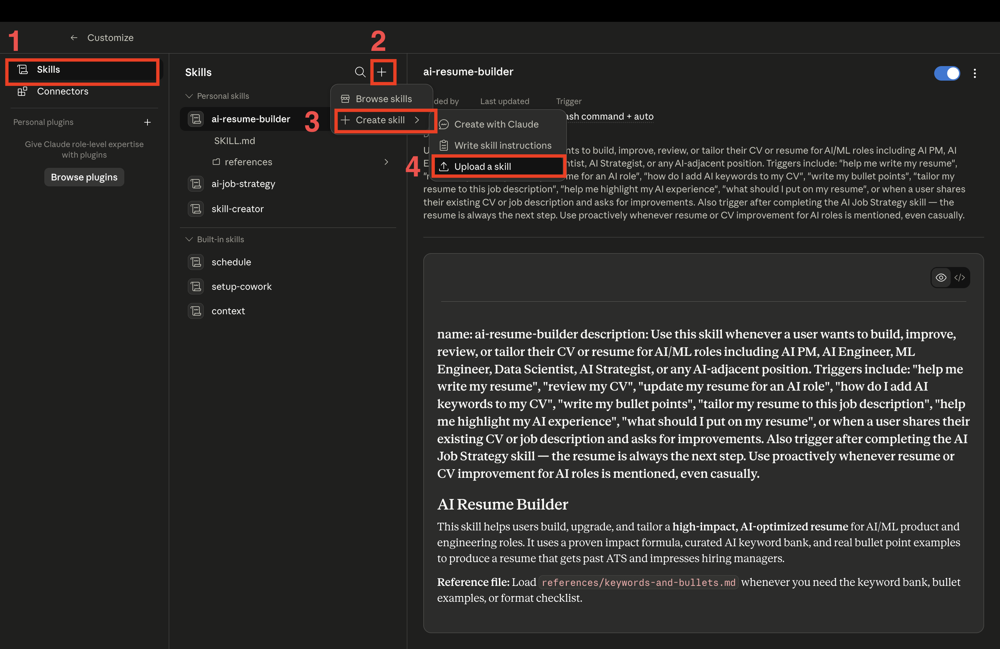
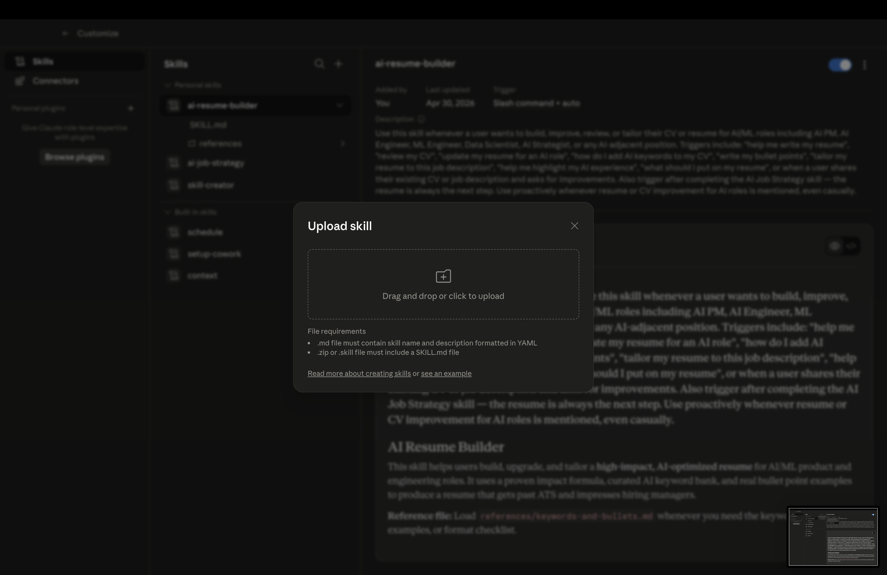
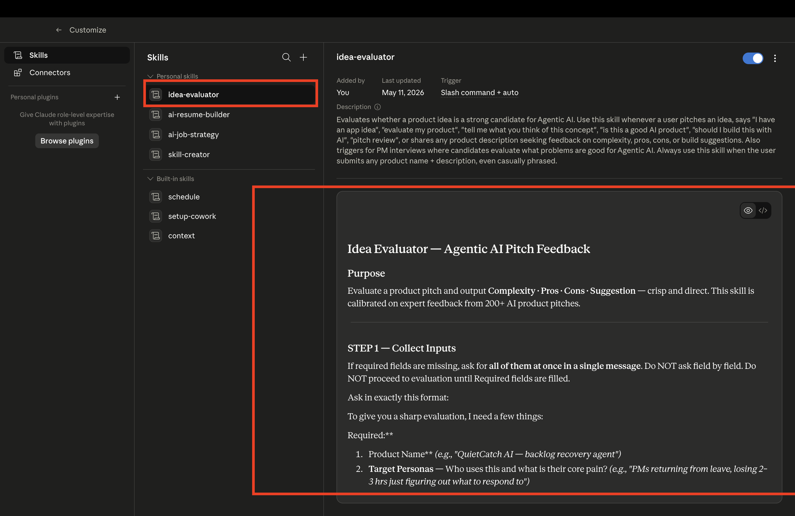
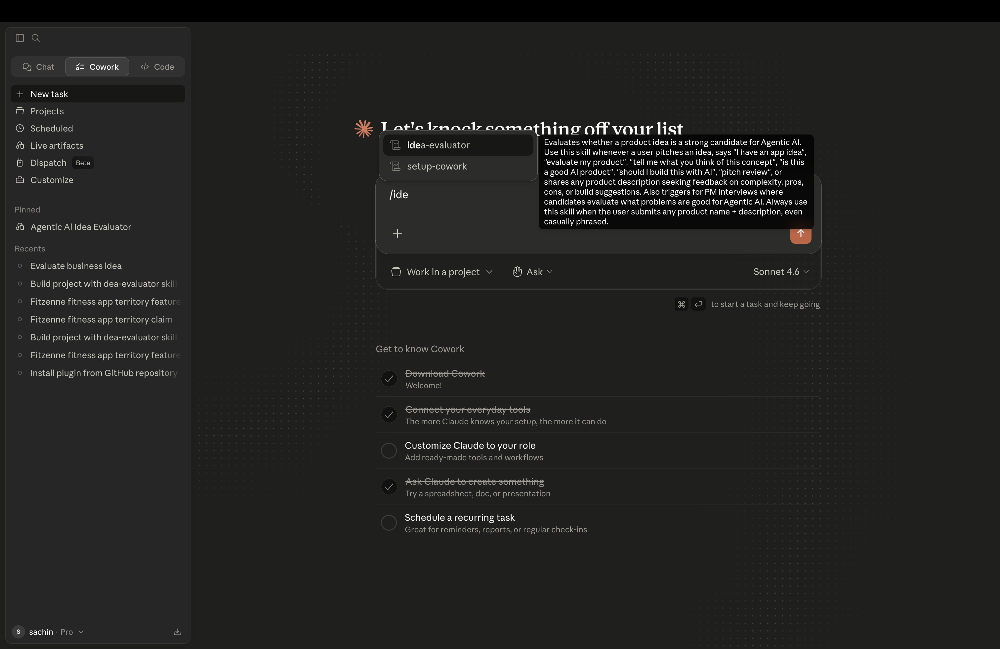

# How to Install Skills in Claude

## Step 1: Open Claude

Open Claude. You can start from any surface — Cowork, or Code.



## Step 2: Go to Cowork and Open Customize

1. In the left sidebar, click **Cowork**
2. Once inside Cowork, click the **Customize** section
   


---

## Step 3: Open Skills and Add a New Skill

1. Click **Skills**
2. Click **Add**
3. Select **Create Skill**
4. Choose **Upload Skill**



---

## Step 4: Upload the Skill File

1. Upload the skill file you downloaded (e.g. `flux one`)



2. Confirm the upload

Repeat Steps 3–4 for each skill file you want to install.




---

## Step 5: Confirm Installation

Once installed, your skills will appear under **Personal Skills**. You can now invoke any of them from a Cowork session by typing the slash command — for example:

```
/skill-name
```

