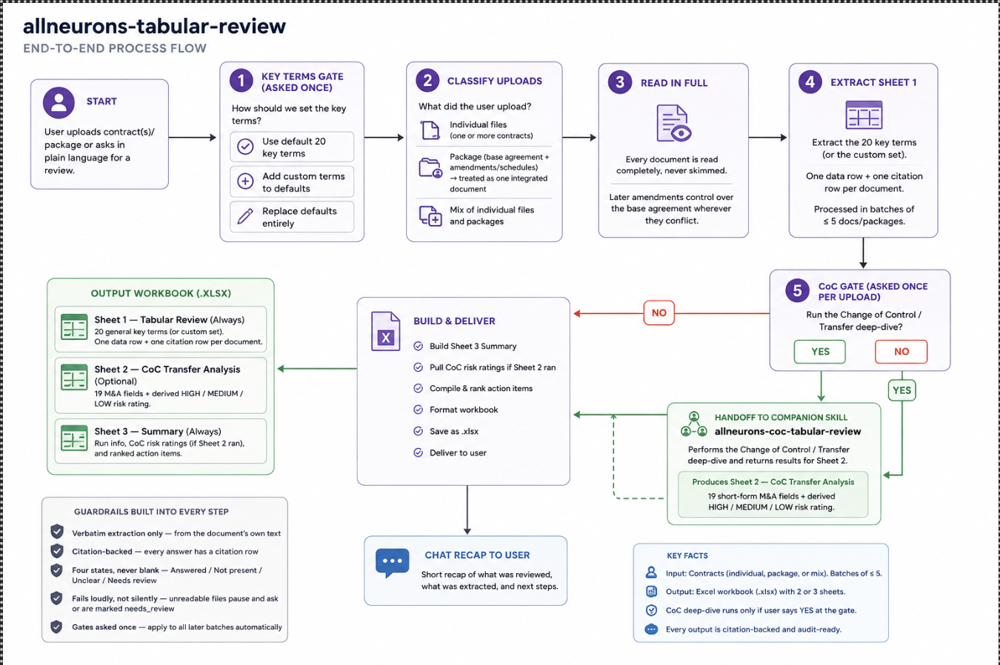
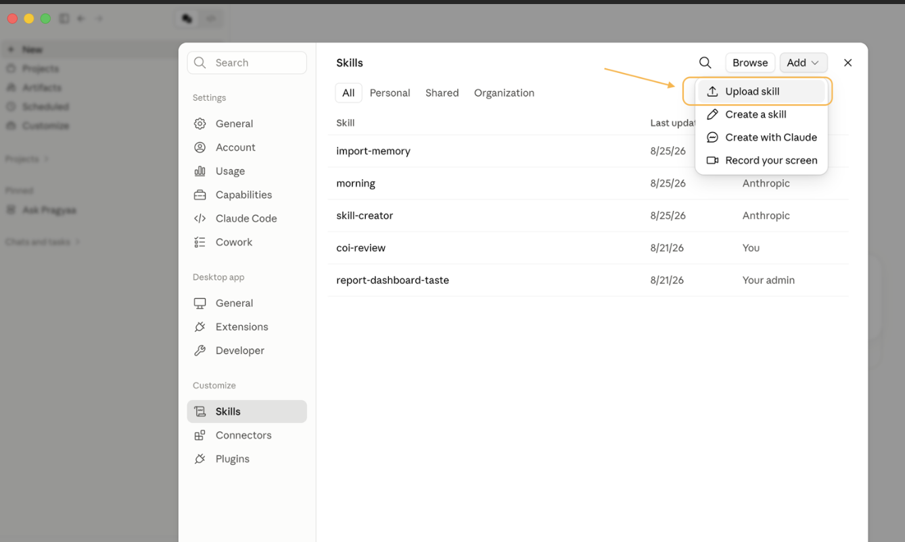
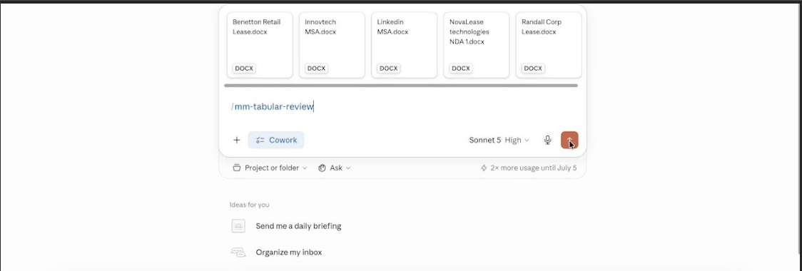
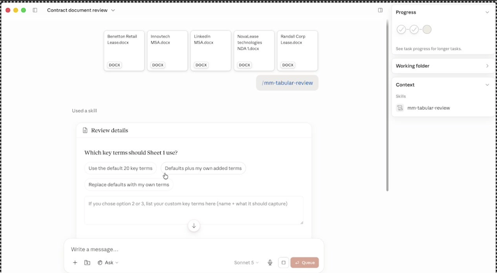
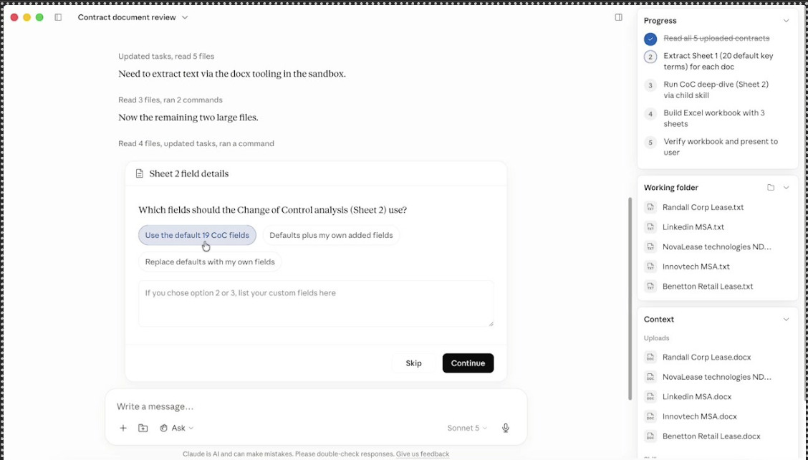
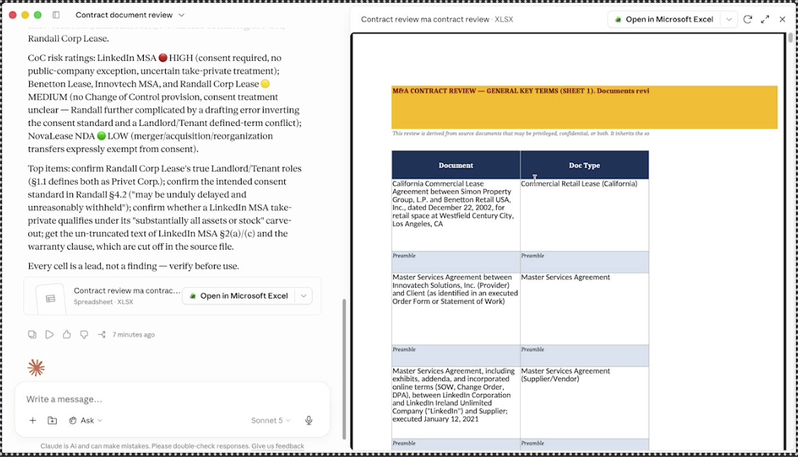
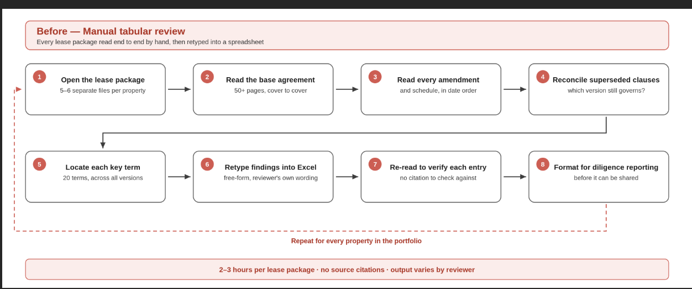
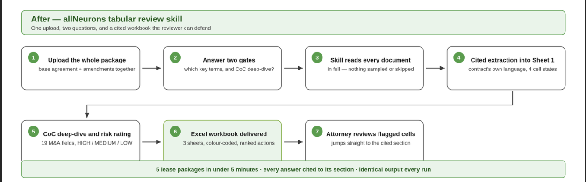

# allneurons-tabular-review

An allNeurons legal AI skill for Claude — commercial contract tabular review.

Companion skill: `allneurons-coc-tabular-review` (Change of Control / Transfer deep-dive)

[Link to diagram](https://pragyaallc-my.sharepoint.com/:i:/g/personal/rajat_legalgraph_ai/IQCBhVCHyYxUTLHY869aKmS-AXsPlhB14WZ-oszqpaHv5AE?e=cMiDmJ)

## Prerequisites

None required to run a review. Both `allneurons-tabular-review` and `allneurons-coc-tabular-review` operate on documents (legal contracts) you upload or point them at directly — individual files, a folder or zip containing a base agreement plus its amendments and schedules, or pasted text. No connector, API key, or configuration file is required to run either skill.

To install and use the skill, you need:

- [Download the skill](https://pragyaallc-my.sharepoint.com/shared?listurl=https%3A%2F%2Fpragyaallc%2Dmy%2Esharepoint%2Ecom%2Fpersonal%2Frajat%5Flegalgraph%5Fai%2FDocuments&id=%2Fpersonal%2Frajat%5Flegalgraph%5Fai%2FDocuments%2FLegalGraph%20AI%2FCowork%20Claude%2FClaude%20Teams%20Plan%2FTabular%20Review%20Skill%2Flegal&ct=1787847489021&or=WORD%2DWEB%2EBODY%2ENT&shareLink=1&ga=1)
- [Don't know how to add a skill in Claude? Click here](../../foundation/setup-skill-in-claude/readme.md)
- Access to Claude Cowork, Claude on web/Desktop, or Claude Code.
- The skill installed from the allNeurons `back-office-agentskills` repository, under `legal/allneurons-tabular-review`.

Optional, not required: connectors for Google Drive, Slack, and DocuSign are recommended conveniences for pulling documents in or pushing results out. Neither skill calls a connector today, so nothing breaks if you skip them.

## The problem this skill solves

Reviewing a stack of commercial contracts for diligence, onboarding, or a portfolio audit means reading every document in full and recording the same handful of terms — parties, term, governing law, assignment, liability, indemnification, and more — in a consistent, comparable format. Done by hand across five, fifteen, or fifty contracts, that work is slow, inconsistent between reviewers, and easy to under-cite: a term summarized without a pointer back to the clause it came from is hard to trust later.

`allneurons-tabular-review` reads every uploaded contract — and every amendment or schedule that modifies it — in full, extracts a defined set of key terms in the document's own language, and cites every answer back to the section it came from. Where the drafting is silent, ambiguous, or needs a human judgment call, it says so explicitly instead of guessing. The result is a standardized, section-cited workbook that gives a lawyer a fast, reliable starting point — not a replacement for reading the contract.

## Who this skill is for

| Role | Use it for |
| --- | --- |
| In-house counsel / GC reviewing vendor, customer, or lease contracts | `allneurons-tabular-review` for the General Key Terms pass |
| M&A counsel / real estate counsel running lease-heavy diligence | `allneurons-tabular-review` plus the `allneurons-coc-tabular-review` Change of Control deep-dive |
| Legal ops / paralegals prepping diligence binders or contract summaries at volume | `allneurons-tabular-review` batch mode (up to 5 documents per batch) |

## Benefits of using this skill

- **Consistent output every time** — the same 20 key terms (or your own house set), the same four-state discipline (Answered / Not present / Unclear / Needs review), and the same citation format across every reviewer and every matter.
- **Every cell is auditable** — each answer is paired with a citation row naming the section it came from, so a reviewer can jump straight to the source instead of re-reading the whole contract to check a claim.
- **Scales to volume** — processes uploads in batches of five, appending to one consolidated workbook, so a 20- or 50-document set doesn't require babysitting.
- **Reads the whole deal, not just the base document** — a package of a base agreement plus amendments and schedules is read together and reviewed as one integrated document.
- **Flags rather than guesses** — password-protected files pause for a password instead of being silently skipped; ambiguous drafting is marked Unclear rather than resolved by assumption.
- **Optional M&A deep-dive on demand** — the Change of Control / Transfer analysis (`allneurons-coc-tabular-review`) adds a 19-field short-form breakdown and a derived risk rating, only when you ask for it.
- **Customizable without touching code** — swap in house-specific key terms or CoC fields at the start of a run, or fork the skill file to make your set the default.
- **Stays in its lane** — every output is labeled a lead for attorney verification, not a finding or legal advice, which keeps the skill useful without inviting over-reliance.

## How to run the skill

**Step 1 — Install the skill**

Go to "Customize" in the Claude application, click "Skills" in the left sidebar, and under Skills click the "Add" button at the top right to upload and install the skill.

**Step 2 — Upload your contracts and start a review**

Start a new chat, attach one or more contracts (or a folder/zip containing a base agreement plus its amendments), and either type `/allneurons-tabular-review` or just ask in plain language — e.g. "review these contracts" or "give me a tabular review of these."

**Step 3 — Answer the Key Terms gate**

Before reading anything, the skill asks whether Sheet 1 should use the default 20 key terms, the defaults plus your own added terms, or your own terms only. Pick the default set for a first run.

**Step 4 — Decide on the Change of Control deep-dive**

After Sheet 1 is complete for the first batch, the skill asks whether to run the Change of Control / Transfer analysis (Sheet 2). Say yes to hand off to `allneurons-coc-tabular-review` — it asks the same default-vs-custom question, scoped to its 19 fields — or no to go straight to the summary. A Progress panel tracks each stage (extraction, CoC deep-dive, workbook build, verification) while it works.

**Step 5 — Review the delivered workbook**

The skill posts a short chat summary — CoC risk ratings and top deal-team action items, if Sheet 2 ran — and delivers the Excel workbook, ready to open.

If a file is password-protected, the skill pauses mid-batch and asks for the password or whether to skip that file. This is expected behavior, not a bug.

### Before / After — allNeurons tabular review skill

**Before**

**After**

## Output

A single Excel workbook (`.xlsx`) with up to three sheets, depending on whether you requested the Change of Control deep-dive:

- **Sheet 1 — Tabular Review.** One data row per document (or document package), covering the 20 default key terms — or your custom set — always immediately followed by a citation row naming the source section for every answer.
- **Sheet 2 — CoC Transfer Analysis** (only if requested). One answer row and one citation row per document across 19 short-form M&A fields — consent triggers, the public-company exception, permitted transfers, take-private treatment, rent escalation, fees, standalone termination/recapture rights, and open questions — plus a derived risk rating (HIGH / MEDIUM / LOW) per document.
- **Sheet 3 — Summary.** Run information, the CoC risk ratings table (if Sheet 2 ran), and a ranked list of deal-team action items — each naming the clause, the issue, and the recommended next step.

Every cell carries one of four states, color-coded for a fast visual scan: Answered (white), Not present (gray), Unclear (yellow), Needs review (yellow). Citation rows are light blue. The workbook opens with an amber work-product banner stating the review title, the documents covered, the date, and the standard verification reminder.

## How it learns

Today, both skills are plain markdown — a `SKILL.md` file per skill, with no build step and no model fine-tuning involved. Fork the file and edit the steps, the gates, the column or field definitions, or the output format directly for house style. That is the entire customization mechanism right now.

Broader mechanism: this skill is built to be community-driven. When a team finds a gap or a better default, that improvement is meant to fold back into the shipped skill for everyone rather than stay siloed in one firm's fork — see [Contributing](#contributing) below for the path.

## Notes

- Every extracted cell is a citation-backed lead, not a finding. Verify against the source document before it informs a rep, schedule, or memo.
- `allneurons-coc-tabular-review`'s default 19 fields are shaped for retail/commercial leases (store number, landlord, landlord parent, lease expiry). They work well out of the box for that use case; for other contract types, use the custom-fields path at the Phase 0 gate until a second default field set ships.
- Password-protected files: the skill pauses mid-batch and asks for the password or whether to skip that file. Expected behavior, not a bug.
- Documents are processed in batches of five by default, appended to one consolidated workbook rather than a separate file per batch.

## Roadmap

More sub-skills, driven by community and practitioner feedback. Planned next:

- **Due Diligence Issue Extraction** — read VDR documents, extract issues per house categories and materiality thresholds into house memo format.
- **Renewal Tracker** — surfaces contracts with upcoming cancel-by deadlines from a maintained renewal register.
- **Entity Compliance** — filing deadlines by entity and jurisdiction, 30/60/90-day lookahead, CSV export.
- **Amendment History** — traces how a contract changed across a base agreement plus amendments.
- **Board Minutes** — drafts board or committee minutes from calendar-detected meetings and agenda materials.

Planned agents:

- **Playbook Monitor** — proposes playbook updates once a clause position has been deviated from enough times.
- **Renewal Watcher** — scheduled weekly post of upcoming renewals to a configured channel.
- **Data Room Watcher** — monitors a VDR for new uploads, posts closing checklist status.

Planned connectors: Google Drive, Slack, DocuSign, Microsoft 365.

## Making it yours

- **Fork a skill for house style.** Each skill is a markdown file at `legal/tabular-review/<skill-name>/SKILL.md`. Edit the steps, the gates, the column/field definitions, or the output format directly.
- **Swap or add connectors.** Point the skill's MCP configuration at your own Drive, Slack, DocuSign, or other MCP-compatible tool. Neither shipped skill calls a connector yet, so nothing breaks if you leave it as-is — this is forward-provisioning for skills and agents that will use them.
- **Add your own field/column set.** Both skills open with a gate that asks default vs. custom fields — if your house default differs from the shipped one (e.g., the CoC skill's retail-lease-shaped 19 fields), answer with your own set each run, or fork the skill to make your set the default.
- **Track your changes against upstream.** Since this repo takes community contributions (see [Contributing](#contributing) below), keep your house fork on a branch or a private overlay so upstream updates don't silently clobber your edits.

No build step. Everything is markdown.

## Contributing

Everything here is markdown — fork, edit, open a pull request.

- **New skill** → add it under `legal/<practice-area>/<skill-name>/SKILL.md` with the same frontmatter style used here (`name`, `description`). Keep the description tight — it is the trigger signal the model uses to decide when to invoke the skill.
- **Parent/child pairs** → if a skill hands off to a companion skill, the way `allneurons-tabular-review` hands off to `allneurons-coc-tabular-review`, say so explicitly in both descriptions and cross-reference the sibling skill by its exact folder name.
- **Nothing goes live without allNeurons team's review.** A pull request into this repo ships in the installable skill set only once an allNeurons maintainer has reviewed and approved it — there is no self-merge and no automatic publish path for outside contributors. Open the PR, and a maintainer will review, request changes if needed, and merge when it's ready.

---

[Link to diagram](https://pragyaallc-my.sharepoint.com/:i:/g/personal/rajat_legalgraph_ai/IQCBhVCHyYxUTLHY869aKmS-AXsPlhB14WZ-oszqpaHv5AE?e=cMiDmJ)
